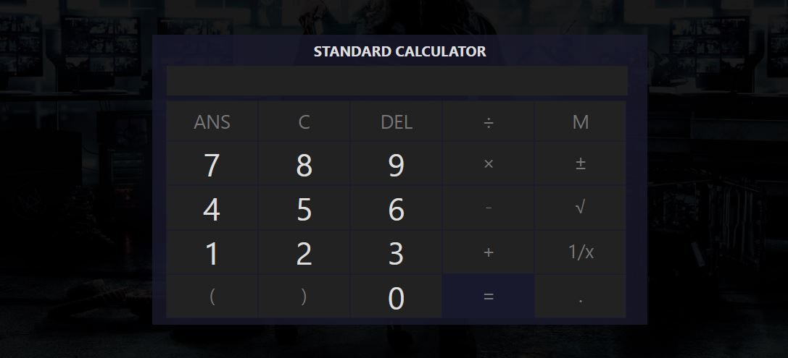

## calculator-javascript

This is a standard calculator that does some simple mathematical operations (+, -, x, and ÷) plus some other
functionalities like square roots and memory. It's very basic but it can benefit anyone who is starting
to learn more about JavaScript.

If you want to learn more about how you can _create a game like this_, clone this repo and go through the code
by yourself.

To view the online demo of the app here at github click [https://sam0132nodier.github.io/calculator-javascript](https://sam0132nodier.github.io/calculator-javascript).